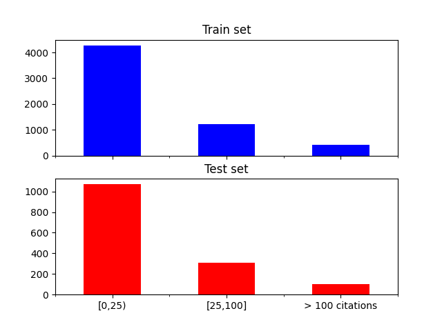
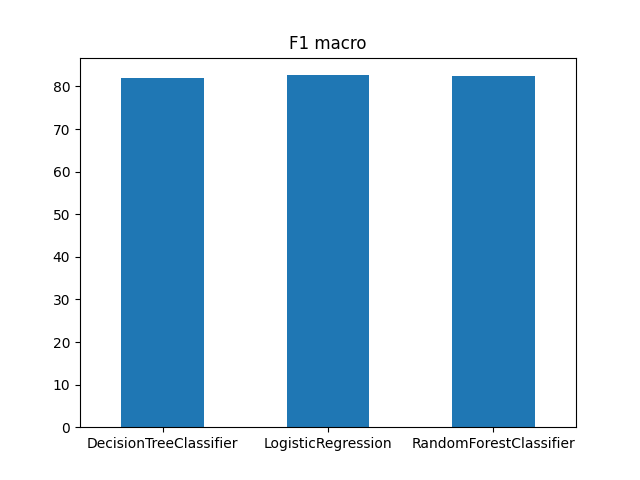
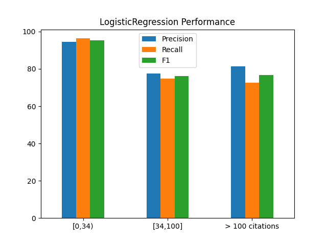
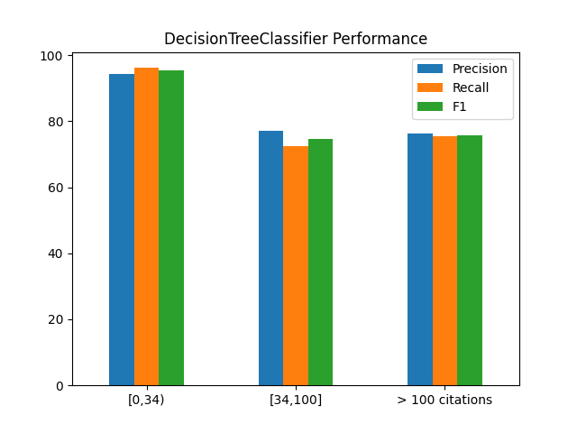
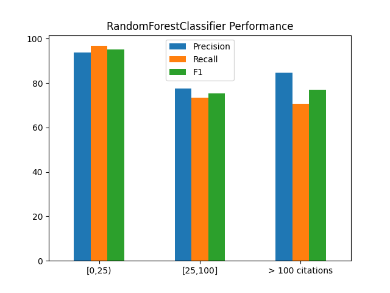

# Citation prediction of articles in theoretical physics

## Introduction and motivation

Each year that passes the number of physics publication increases at a high rate. Most of them receive little to no attention while a very small minority redefines their respective field of research. Because of this high number of articles, it can be sometimes hard to gauge which one deserves interest. Modern recommendation softwares are often very competent at providing related articles based on keywords. 

Another more interesting aspect of trying to predict the number of citations, with respect to some user input, is the possibility of catching on a promising lead early on. This could help for instance a starting researcher find an unbeaten path. This approach assumes that a given learning model make a prediction at the instant the article is uploaded in the database. It would take as features for example the author's citation background or elements from the article itself, which would be a more advanced analysis.

Although this is a clear future goal of this project, for the time being the focus is on predicting the total number of citations up to some year with the knowledge of the citation data of the first three years. Moreover, a precise prediction of this number is not envisaged as it is a quite complex regression, but rather to anticipate the group the article belongs to, namely lesser impact, impactful and influential. Many researches in academia have already tackled a similar problem[[1]](https://arxiv.org/abs/1809.04365)[[2]](https://arxiv.org/pdf/2012.15192.pdf). The parameter space studied in this project was taken from the second article.

## Datasets

The theoretical physics articles were collected on [ArXiV](https://arxiv.org/) using the associated [API](https://arxiv.org/help/api/basics). The acessible data was the names of the authors, the date of creation (when the authors uploaded the article) and the unique id number that ArXiV gives to each article. This part of the harvesting was performed in [get_data.py](src/data/get_data.py).

In order to get the total citation count but also the number of citations that an article get each year after it is created, it was necessary to use the [InspireHep API](https://github.com/inspirehep/rest-api-doc) (InspireHEP is a database that gathers articles in high energy physics). For more information, please refer to the script [get_citations.py](src/data/get_citations.py).

The initial project was to study all the articles uploaded from year 1995 to 2015, but since each API limited the number of requests per second, a sleeping time was sometimes mandatory, which rendered the process very long.  Due to time constraints, only the articles between 01-01-2010 and 01-01-2015 were considered.
Therefore, the full dataset comprises 7397 valid `hep-th` articles. The structure of the [entire dataset](data/final/data_hepTH_2010_2015.xlsx) is represented in the table below. A [data dictionnary](data/data_dictionnary.txt) is also provided.

|title|abstract|categories|created|arxiv_id|doi|Total|2010|2011|...|2022|
|-----|--------|----------|-------|--------|---|-----|----|----|---|----|
|Text |Text    |Text      |Integer|Text    |Text|Integer|Integer|Integer|...|Integer|
|A bulk inflaton...|The universe may have...|hep-th|2010|1001.1423|10.1016/j.physletb.2010.10.036|8|4|1|...|0|
|Integrability of N = 6 ...|In 2008, Aharony, Bergman, Jafferis, and Maldacena (ABJM)...|hep-th|2011|1105.3231|No doi|15|0|4|...|1|

Note that it is possible that the sum of citations from 2010 to 2022 is not equal to Total. The scraping parameter that controlls the number of citing articles is `sort=mostcited&size=500&page=1` in [get_citations.py](src/data/get_citations.py). By changing this number or the page, you can have access to more citations. This works mostly for low-citations articles but the highly cited ones show often this inequality. Nevertheless, it is not a problem since the latter are cited a lot in the first years.

As a first observation, it's interesting to look at the distribution and the statistics of the total number of citations per article, as it is shown below.

  

|Count|Mean|Min|Max|75%|
|-----|----|---|---|---|
|7397|34|0|2958|38|

One can see that the large majority of articles receive little to no citations. The 75th percentile is already at 38 citations and the mean is only 34. The citation distribution for this dataset is long-tailed and corresponds more or less to a power law, as it was concluded in other [citation studies](https://arxiv.org/pdf/physics/0407137.pdf). Thus, it is important to account of this imbalanced classification when selecting the training and testing set. More on that in the next section.

## Methodology

### Features and sampling
The features used in the first place were simply the number of citations during the three years after the first version of was published. For instance, if some was article was uploaded first in the year 2010 (no matter the month), the numbers collected were the citations in 2010 to which we added the citations in 2011, then the citations in 2012 and finally the citations in 2013.  The line of thought here is that if an article gains some momentum in the first three years, then it's likely that it will be at least cited a lot.

The label associated to the three features is the total number of citations from the uploading year to 2022, which was divided into three unequal categories. Indeed, here the goal is not to get the precise number of citations an article will get in the future, that's why a rough classification was privileged.
The first category, namely **A**, include the articles that have a total of citations below the mean (34). The second category **B** corresponds to articles with citations between 34 and 100. The third and final category **C** are the articles with more than 100 citations. These categories follow respectively a (75,20,5) rule approximatively. Hence, the full set must be split into training/test sets accordingly. A `StratifiedShuffleSplit` was used instead of the usual `train_test_split` because the latter through its random sampling can introduce a bias in each set, meaning that some category could be overrepresented. The dataset was split in the 80/20 fashion.
The [script](src/models/sampling_features.py) `sampling_features.py` processes what has been discussed in the last two paragraphs. The next image shows the distribution of the three categories in the two sets.

    

### Models

The choice of classifiers is pretty standard. For the time being, only a logistic regression, a decision tree and a random forest were implemented. The table of the parameter space explored with a 5-fold exhaustive grid search and the results is shown below. The F1-score was used to discriminate (see next subsection).

|        |Logistic Regression|Decision Tree|Random Forest|
|--------|-------------------|-------------|-------------|
|Parameter space|'solver' : ['saga','lbfgs','newton-cg']|'max_depth' : [x+1 for x in range(32)], 'min_samples_split' : [2, 5, 10, 20, 50, 100, 200], 'min_samples_leaf' : [1, 4, 7, 10] |'criterion' : ['gini','entropy'], 'max_depth' : [1, 5, 10, 50], 'max_features' : ['log2','sqrt'], 'n_estimators' : [100, 150, 200, 250, 300]|
|CV Result|'solver' : 'saga', 'max_iter' : 2000|'max_depth' : 9, 'min_samples_split' : 50, 'min_samples_leaf' : 7|'criterion' : 'entropy', 'max_depth' : 5, 'max_features' : 'log2', 'n_estimators' : 150|

Note that some interval of the maximum iteration was also put to tune, but it gave rise to a convergence error. A number of iteration of a 2000 was found to be enough and did not lead to divergence.

### Metrics

In the spirit of a quick and dirty analysis, the F1-score was chosen to determine how good a classifier is. In an imbalanced setting, it is highly preferable to use this metric instead of accuracy, since the latter, by definition, will be close to 1 if one class is much more represented. One can also find conceptual problems with the F1 score such as the fact that the precision and recall are given the same weight, but in this project's case, the difference between a false positive and a false negative is not of critical importance (F1β can do the job). Many other classification metrics can be implemented in a similar manner and will be in the next project stages (for instance the kappa or Jaccard metrics).

Moreover, it is crucial to consider the correct F1 averaging. Here, the `macro` average was used so that the F1 score of each class weighs the same. Indeed, the models should give a good prediction no matter the category an article belongs to. That's why the `micro` average, which is equivalent to the accuracy for multiclass problems with only label per features and the `weight` average, which would skew the score towards 1 because of othe major percentage of class **A** labels, were not used.

## Results

The figure below compares the F1 score of each classifier. It seems the three models predicts equally well the article's category.

    

The precision, recall and F1 score per category as measured by each estimator can be also observed to have a high values as shown in the three figures below. The precision, recall and F1 scores follow the same trend across the three classifier i.e. lower values for the minority category. Overall, the decision tree seems to be the best one since its recall for **CC** is at the same level as the other metrics. 

    

    

    

## Future implementations

This project is definitely not a closed one. To the day this is being written, other ideas are being thought of, such as evaluating other models like SVM or Gradient Boosting. The next logical step would be to include in the features the citations that the authors received before the article has been published. Indeed, an article written by a reputed physicist has more chances to be cited. Also, it is interesting to investigate the role of the abstract and the google HITS in the citation evolution of an article. A neural network could be useful and has been used other times. Finally, one could also increase the statistics and study if the models scale well to new data.
