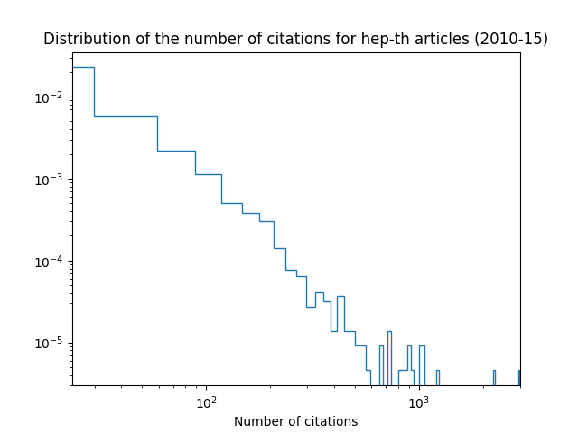

# Citation prediction of articles in theoretical physics
## Introduction and overview

## Datasets

The theoretical physics articles were collected on [ArXiV](https://arxiv.org/) using the associated [API](https://arxiv.org/help/api/basics). The acessible data was the names of the authors, the date of creation (when the authors uploaded the article) and the unique id number that ArXiV gives to each article. This part of the harvesting was performed in `get_data.py` [here](src/data/get_data.py).

In order to get the total citation count but also the number of citations that an article get each year after it is created, it was necessary to use the [InspireHep API](https://github.com/inspirehep/rest-api-doc) (InspireHEP is a database that gathers articles in high energy physics). For more information, please refer to the script `get_citations.py` [here](src/data/get_citations.py).

Since each API limited the number of requests per second, a sleeping time was sometimes mandatory, which rendered the process very long. The initial project was to study all the articles uploaded from the website creation to roughly 2015. Due to time constraints, only the articles between 01-01-2010 and 01-01-2015 were considered.
Therefore, the full dataset comprises 7397 valid `hep-th` articles.

As a first observation, it's interesting to look at the distribution and the statistics of the total number of citations per article, as it is shown .

## Methodology

## Results
### Logistic Regression

### Decision Tree

### Random Forest

## Future implementations
